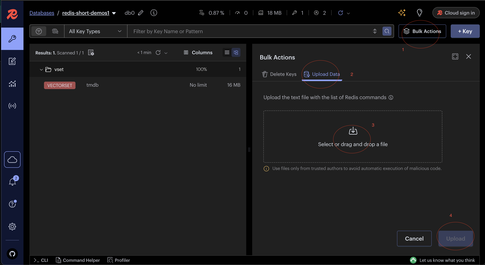

# VectorSets Face Similarity Demo

This project demonstrates face similarity search using **Redis VectorSets**. It features a **Next.js frontend**, a **Node.js backend**, and **AI-powered face embedding** capabilities.

## Quick Start

### Clone

```bash

git clone https://github.com/PrasanKumar93/vectorsets-face-similarity.git
cd vectorsets-face-similarity
```

### Modify Environment Variables (optional)

Modify the environment files to change default configurations.
`backend/.env.docker` and `frontend/.env.docker`

### Start with Docker

If you have **Docker** and **Docker Compose** installed, you can quickly start all services.

```bash
# Start all services
docker-compose up --build

# Stop all services
docker-compose down
```

**Access the services at these URLs:**

- **Frontend**: `http://localhost:3000`
- **Backend**: `http://localhost:3001`
- **Redis**: `localhost:6379`

For more detailed instructions on using Docker, see the **DOCKER_README.md** file.

## 🔧 Local Development

To run the services locally without Docker, follow these steps:

### Backend Setup

- (optional) update `backend/.env` file to change default configurations.

```bash
cd backend
npm install
npm run dev
```

### Frontend Setup

- (optional) update `frontend/.env` file to change default configurations.

```bash
cd frontend
npm install
npm run dev
```

## Database

If you start with `docker-compose`, the database will automatically load the `database/redis-data/dump.rdb` file. Otherwise, follow these steps to load the data:

1> Upload the `database/tmdb/output/tmdb.redis` and `database/celebrity-1000-embeddings/output/celebs.redis` files to your Redis database (e.g., `redis://localhost:6379`).

2> You can use the Bulk Actions -> Upload Data feature in Redis Insight.


